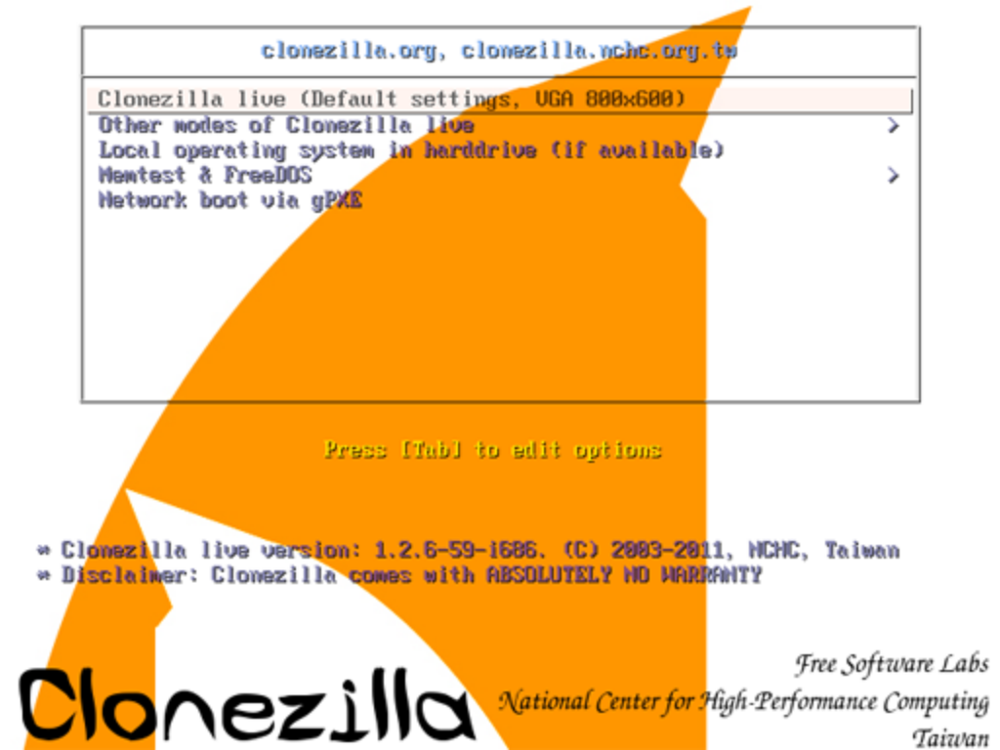
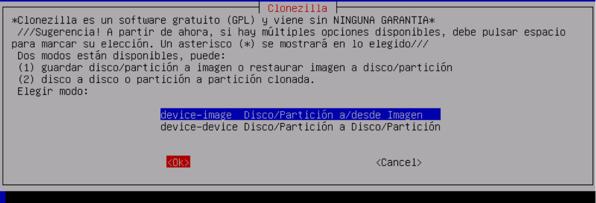
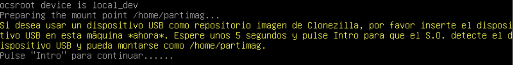
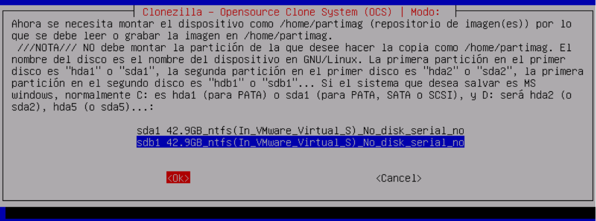

# Creación de imágenes maestras usando Clonezilla

En clase hemos visto que vamos a utilizar Clonezilla para la creación de imágenes para equipos pero antes de comenzar vamos a listar los beneficios que tiene su uso.

* **Configuración**

Si usáramos otros programas deberíamos ir equipo a equipo restaurando cada instalación; cosa que puede suponer hasta 2 horas en cada PC pues habrá que encender, meter discos, configuraciones, esperar y retirar.
Con Clonezilla nos podemos ahorrar todos esos pasos configurándose una sola vez en el servidor y solo tendremos que encender los pcs físicamente, e incluso podemos evitar este paso si disponemos de una WOL.

* **Velocidad**

Clonezilla permite que una imagen sea enviada por red y sean los equipos las que la cojan sin tener que enviarla una vez por PC. Esto permite un ahorro exponencial de tiempo, gracias al cual una empresa que podría haber tardado semanas en volver a ponerse en activo puede estar de nuevo en funcionamiento en solo un par horas dependiendo de la variedad de dispositivos que se tengan en esta.
Una restauración o clonación acostumbra a durar entre 5 y 30 minutos (2-20gb).

# Procedimiento

## Descarga

Primero deberemos descargar el archivo necesario.
Nos descargaremos la última versión en .iso, ya sea para Clonezilla Live o Clonezilla Server.

En el caso de querer instalar un Clonezilla server en un servidor ya funcional se añadirán los repositorios y se usará desde el sistema directamente.

Una vez descargada bastará abrirlas con un programa de grabación (no se necesito ninguno específico) como podría ser ImgBurn, InfraRecorder o por ejemplo algunos de los que viene por defecto instalado en el sistema (Brasero para Gnome por ejemplo).

Una vez grabada la imagen .iso ya tendremos un disco bootable con el cual poder usar el sistema.

También podremos arrancar mediante usb y red de formas más avanzadas si lo deseamos, pero normalmente lo mas compatible y fácil es arrancar mediante un disco.

## Arranque

* **Arranque**

Por defecto los pcs arrancarán desde el disco duro interno en el cual esta el sistema operativo actual, para poder arrancar desde un disco, usb o red habrá normalmente que elegirlo pero en algunos casos ya estará configurado para que arranque desde ellos si es posible

* **Boot Menu**

Los ordenadores modernos acostumbran a tener un menú simple desde el cual elegir desde donde quieres arrancar, nada mas encender el PC aparecerán seguramente esa información en pantalla llamándole “boot menu”, normalmente  se activa pulsando la tecla Esc o desde la tecla F8 a la F12 dependiendo del modelo. Una vez en el podrás elegir desde donde arrancar.

### BIOS

Si no dispones de un menú para elegir la unidad se deberá configurar el arranque desde la BIOS. Para ello al arrancar el equipo te observaras la forma de acceder a ella siendo habitualmente pulsar el botón de Del/Supr, F2 o semejantes.
Así nos aparecerá un menú que puede llegar a ser realmente complejo, a nosotros solo nos interesa la opciones de arranque por lo cual buscaremos un menú que contenga las palabras “boot” o “arranque”, allí colocaremos la unidad que nos interese como la primera y nos saldremos del menú yéndonos al menú de salida y guardando cambios (save and exit).

En caso de carecer de unidad óptica y no querer arrancar por USB (o ser un equipo antiguo que carezca de esa opción), podríamos intentar arrancar por red.
Esto también puede hacerse desde un Live si es necesario y tenemos un servidor montado.

## Creación de una Copia de Seguridad

Antes de nada será necesaria descargar la ultima versión de Clonezilla Live para evitarnos problemas, una vez grabada en un disco o pasada a un Live USB que tendremos que preparar con Rufus e iniciaremos desde ella (configurado previamente como dispositivo de arranque en la BIOS o iniciarla desde el boot menu si esta disponible).

Una vez arrancado aparecerá el menú principal del disco en el cual elegir las herramientas que nos interesa usar del disco, para desplazarnos entre ellas simplemente usaremos las flechas del teclado e Intro para aceptar.

## Menú de inicio

En este menú podremos ver las siguientes opciones:

* **Clonezilla Live**

Es la Forma habitual de acceder a Clonezilla Live con la configuración por defecto.

* **Otros modos**

Otras configuraciones básicas para Clonezilla Live como distintas resoluciones, cargar en RAM y modos a prueba de fallos.

* **Arrancar sistema operativo del disco duro principal**

Si hemos arrancado de un disco u otro dispositivo por error con este podremos arrancar el dispositivo directamente. También puede ser a veces la entrada por defecto sino elegimos nada (muy útil para desatendidos o arranques por red).

* **Memtest y FreeDos**

Memtest es un programa para testear la memoria ram lo cual permite un correcto diagnóstico de esta, para ello hace distintos test y los repite además para comprobar la estabilidad de esta. Muy útil pues Clonezilla Live se carga en ram y si esta está defectuosa no funcionará correctamente.

FreeDos sin embargo es un sistema operativo libre con características semejantes a MS-Dos con entorno de comandos compatible con este.

* **Arrancar mediante red con gPXE**

Muy útil para acceder a los servicios prestados por un servidor por ejemplo de Clonezilla Server.

Esto además nos evita configurar la BIOS o acceder al bootmenu en los casos que esté configurado otro medio o incluso permitir arrancar por red si por defecto no hubiera opción para ello.

## Dispositivo o imagen

La primera opción que nos presenta Clonezilla es si la copia de seguridad será de un dispositivo a otro *(devive-device)* o si trabajamos con archivos *(device-image)*.

Si elegimos hacerlo de dispositivo a dispositivo porque queramos simplemente clonar exactamente igual un disco duro a otro (uno mejor o el nuestro empieza a fallar) o incluso si es un USB o disco duro externo. La gran diferencia de esta opción con lo que explicaremos a continuación será que se limita a elegir dispositivos, no archivos.

## Seleccionar dispositivo

En nuestro caso hemos elegido device-image pues nos interesará casi siempre más que la copia de seguridad sea una imagen.

>Una imagen no es más que un archivo o conjunto de archivos que representan el contenido de otro dispositivo para poder luego usarlo posteriormente. Si, el archivo .iso que descargamos antes es una imagen la cual nos permite manejar este sistema perfectamente.

En este menú podemos elegir...

* local_dev

La imagen estará en un dispositivo conectado al pc de donde ejecutemos clonezilla, es el uso más común en entornos domésticos y para la mayoría de usuarios no profesionales.

* ssh_server

La imagen estará en un servidor remoto al cual nos conectaremos por SSH, habitualmente son servidores GNU/Linux y permite que almacenemos la imagen en cualquier lugar del mundo, solo para gente avanzada. Te conectas al servidor con dirección del servidor, usuario y clave de acceso además de cifrar las conexiones.
* samba_server

La imagen estará en un servidor remoto al cual nos conectaremos mediante samba. Es la formas más habitual de tener una copia de seguridad remota mediante red pues la mayoría de NAS (discos duros en red), sistemas Windows, sistemas GNU/Linux y Mac OS/X permiten compartir carpetas en red sin necesidad de configuraciones avanzadas.
* nfs_server

La imagen estará en un servidor remoto al cual nos conectaremos mediante NFS. Normalmente son servidores GNU/Linux especialmente configurados. Se usan en entornos montados de manera profesional habitualmente.
* enter_shell

Entorno de comandos
* skip

Saltar este paso, se guardará donde este instalado el sistema. Esto se usa habitualmente cuando clonezilla está instalado en un servidor o incluso cuando las imágenes son muy pequeñas (disquettes, pendrives, etc) y pueden almacenarse temporalmente en memoria. Solo para avanzados.

Seleccionaremos dispositivo local (local dev), entonces nos saldrá abajo un mensaje en color pidiéndonos que si vamos a usar algún dispositivo usb externo, lo enchufamos, esperamos unos 5 segundos para que lo reconozca y pulsemos Intro

Tras esto listará todos los dispositivos.

Aquí elegiremos donde se guardara la imagen, os explicaremos como se muestran las particiones en sistemas GNU/Linux, pues así es como las identificará Clonezilla:

* Empezará con el patrón sdX0

* X será una letra que indicará el dispositivo (empezando por orden alfabético)
* 0 será un número que indicará la partición
* De 1 a 4 serán particiones primarias,
* De 5 para delante serán particiones lógicas
En un dispositivo sólo puede haber 4 particiones, de las cuales hasta una puede ser extendida.
Dentro de una partición extendida puedes meter todas las lógicas que puedas.
Luego muestra el tamaño de la partición y su formato.
Al final muestra además la identificación que le da el fabricante, en el caso de máquinas virtuales saldrán nombres específicos de ella.
Ej: sdc6 será el dispositivo 3 partición lógica 2.

Una vez elegida la partición nos pedirá que elijamos además la carpeta para el archivo de imagen. Nos mostrará entonces el espacio ocupado.
En el caso de haber elegido clonar de dispositivo a dispositivo al principio no saldrá la opción de elegir carpeta ni más tarde archivos

