# Modo de Ejecución

## Parámetros principiante

En este menú podremos elegir el modo por defecto (Beginner) o avanzado (Expert), en el modo avanzado nos mostraran aún más opciones mas tarde.

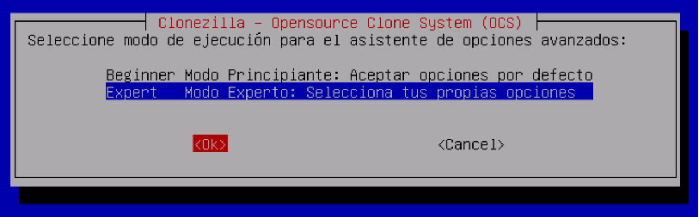

Y aquí tenemos el menú de ejecución donde elegiremos el objetivo de nuestra copia de seguridad:
* savedisk

Guardar un dispositivo de almacenamiento en una imagen.
* saveparts

Guardar particiones en una imagen.
* restoredisk

Restaurar una imagen a un dispositivo de almacenamiento.
* restoreparts

Restaurar particiones de una imagen a particiones.
* recovery-iso-zip

Creara una imagen comprimida de recuperación junto a Clonezilla Live, no tan recomendable debido al tamaño que ocupan los sistemas modernos.
* exit

Nos enviará al entorno de comandos.

En este caso guardaremos particiones (saveparts)

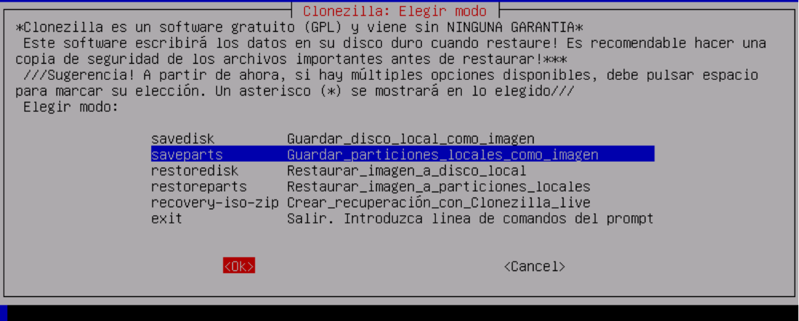

Una vez elegida la opción entonces nos pedirá que introduzcamos el nombre de la carpeta donde se guardará la copia de seguridad.

Por defecto cogera el formato: *año-mes-día-hora-”img”* y se recomendaría poner luego un nombre descriptivo. Por suerte así podrás almacenar cientos de copias y tener organizadas temporalmente de forma automática.

Clonezilla guarda en una carpeta todos los archivos necesarios para la copia de seguridad, esto incluye diversas partes de la imagen (para compatibilidad y mayor facilidad de almacenamiento).

También se incluyen si se han elegido el MD5 o SHA1 para comprobación de la imagen.

Este es prácticamente el único punto donde notaras el idioma elegido en el teclado con lo cual puede ser más complejo, especialmente interesante cuando quieras poner otro “-”. 

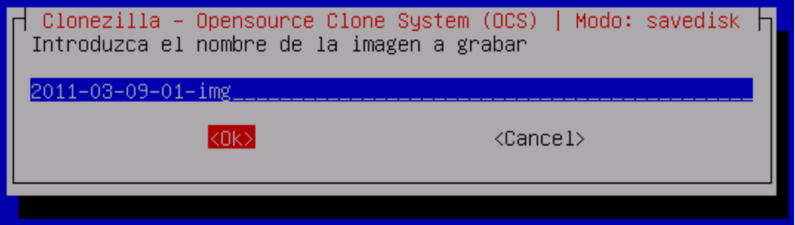

Elegimos las particiones que queramos guardar (márcalas pulsando la tecla espacio)

>En el caso de hacer una copia de seguridad de GNU/Linux para meterla en otra partición seria recomendable que en el fstab estuvieran definidas las partición con nomenclatura /dev/sdX en vez de con UUID para evitar posteriores conflictos. En caso de tener problemas una vez restaurada la imagen estos pueden ser modificados.

## Parámetros avanzados
Si a la hora de elegir el modo hubiéramos elegido el modo experto nos hubieran salido estas opciones avanzadas

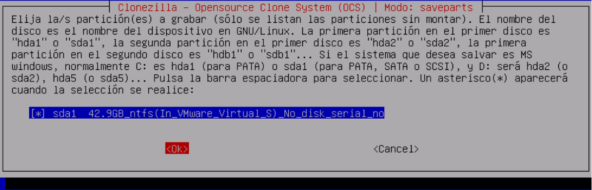

En los métodos de copiado el de por defecto (-q2) pues es el más compatible, son útiles cuando necesite guardar hasta el espacio no ocupado (-q1) o colocar una opción más específica cuando se vaya a usar de forma desatendida (-q si solo se usan partición NTFS por ejemplo).

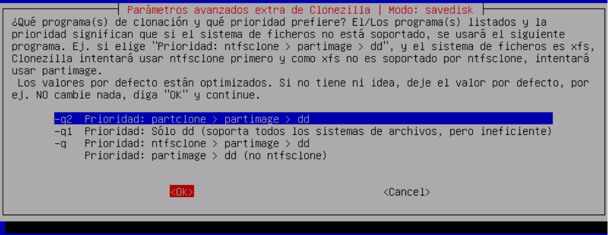

Después tendremos una lista de parámetros avanzados seleccionables:
* -c

No empezará a clonar hasta que lo confirmemos.
* -j2

Clona datos entre el MBR y la primera partición, es bueno dejarla por defecto, nunca se sabe, importante si tenemos sistemas EFI.
* -nogui

Solo se usará modo texto (a estas alturas ya no es algo muy importante).

* -a

No forzar el DMA en el disco duro, por si tenemos problemas con él.
* -rm-win-swap-hib

No copiará los archivos de hibernación o paginación, esto puede llegar a ahorrarnos hasta 4Gb fácilmente debido ya que en caso contrario deberán copiarse totalmente siendo estos normalmente datos aleatorios o vacíos.
* -ntfs-ok

Omitir el comprobar las particiones NTFS, útil si estas dan errores que nos impida hacer la copia de seguridad.
* -rescue

Copiara incluso si no se puede leer bien los datos del disco, importante para cuando tenemos un disco duro moribundo.
* -fsck-src-part

Comprobación previa del sistema de ficheros, importante sino se ha comprobado antes pues en caso de errores impediría la correcta clonación.
* -gm

Genera MD5 para en un futuro poder comprobar la integridad de la imagen.
* -gs

Genera SHA1 para en un futuro poder comprobar la integridad de la imagen.

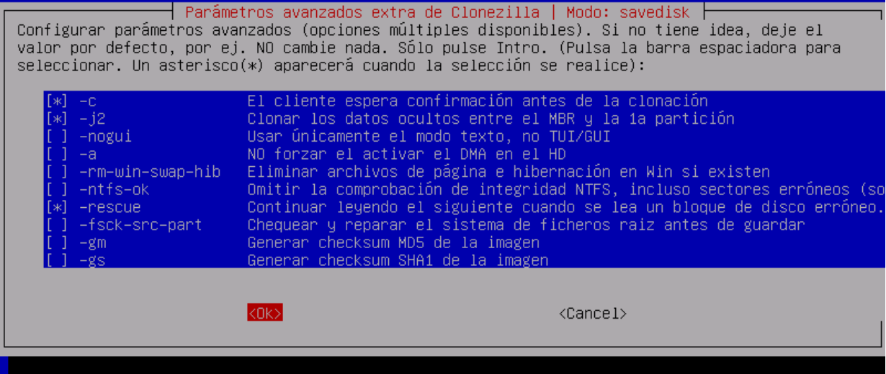

Y ya casi al final elegiremos el método de compresión que variará de -z1 a -z6 aumentando la comprensión y por tanto el tiempo que se lleve para comprimir y descomprimir. Se recomienda un valor de -z2 que proporciona un equilibrio suficiente para la mayoría de veces. En casos específicos se puede usar -z0 lo cual indicaría que no usara compresión alguna.

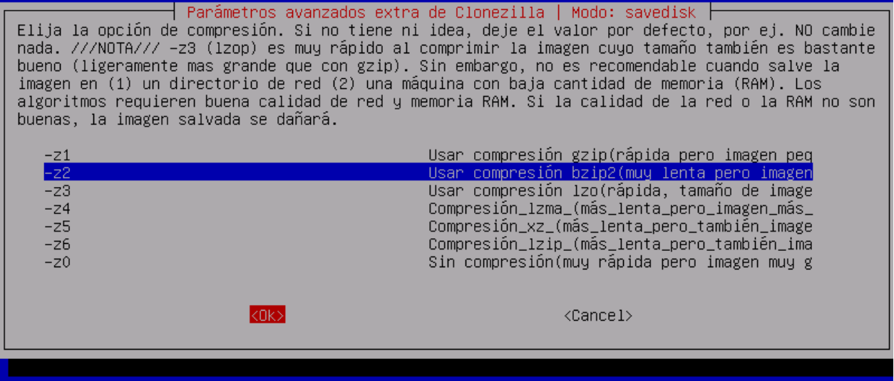

Y poco antes de empezar el proceso de clonado se nos preguntará de que tamaño deben ser las partes en las que se dividirá la copia de seguridad, dejarlo por defecto es bastante válido pero no puede ponerse nunca 0, si se quiere en un solo archivo habrá que colocar un número bastante grande para que no se divida como podría ser 10000000 (10Tb).

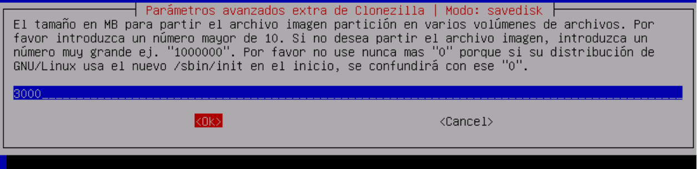

Como última opción nos ofrecerá la posibilidad de al terminar apagarse (-p poweroff), reiniciar (-p reboot) o simplemente no hacer nada esperando nuestra respuesta (-p true) 

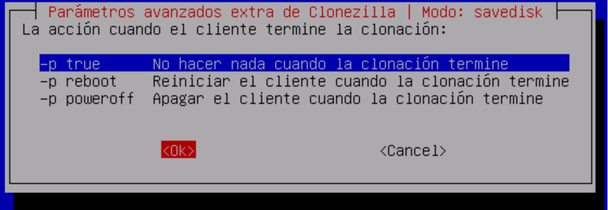

## Ejecución 

Ya para terminar nos mostrará el comando completo para que podamos apuntarlo para poder usarlo en otra ocasión directamente.

Este como será la unión de todas las opciones elegidas anteriormente incluyendo las avanzadas.

Para introducirla en un futuro bastará con entrar en entorno de comandos en cualquier momento e introducirla allí.

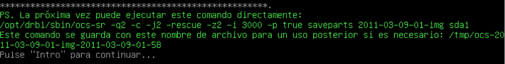

Ahora nos pedirá preguntará si estamos seguros de lo que vamos a hacer (pues podríamos perder datos si estamos restaurando o escribiendo sobre un archivo de imagen o partición existente) y una vez aceptemos veremos como se ejecuta el proceso indicando el % de cada una de las acciones y terminando con la orden que le diéramos al final si elegimos apagar o reiniciar, en caso contrario, podremos ver si el proceso terminó correctamente y si hubo fallos, mirar donde los hubo para así poderlos solucionar añadiendo parámetros extras.

Una vez terminado el trabajo podremos mover y llevarnos sin problemas la carpeta resultante a donde queramos, copiarla, restaurarla o lo que necesitemos.	

En algunos casos específicos de Grub y otros gestores de arranque deberás restaurar su instalación (desde live cd o discos de instalación debido a que estos pueden ser más modernos que la versión de Clonezilla que este siendo utilizada).

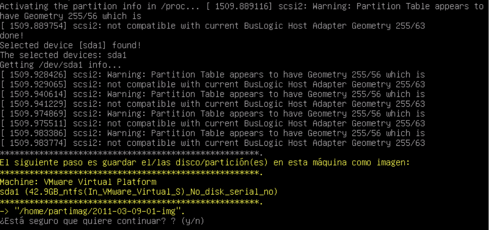