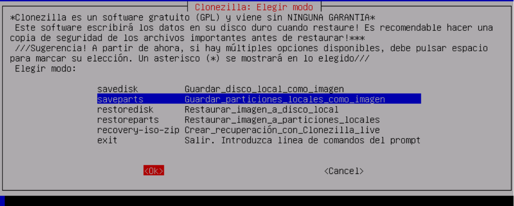

# Recuperación de imágenes

El proceso de restauración será igual que el proceso de creación de copias de seguridad en el cual en vez de seleccionar la opción de guardar partición *(saveparts)* o dispositivos *(savedisk)* elegiremos las de *restoredisk* (dispositivos) o *restoreparts* (particiones) según nos sea necesario.

Después de ello continuaremos con algunas opciones específicas de la restauración que se nos ofrecerán:
Por defecto: Usa la tabla de particiones de la imagen
* -k: No crear tabla de particiones (solo útil si estamos restaurando sobre un dispositivo que ya contenía anteriormente las particiones que fuéramos a restaurar).
* -k1: Sustituye la tabla de particiones actual por una adecuada para las partición de la copia de seguridad (necesario cuando queramos restaurar particiones en un nuevo disco duro).
* -k2: Crearla mediante línea de comandos
* -j0: Usar dd para crear la tabla de particiones

## Elección de copia de seguridad

Una vez elegido ellos se continúa sin mayores cambios hasta llegar a la elección de la imagen a restaurar. Para ello nos listará las copias de seguridad existentes en el directorio elegido anteriormente.

Una vez elegida elegiremos el dispositivo destino (podrían existir varios) y ya procederá de forma habitual hasta finalizar su ejecución.
